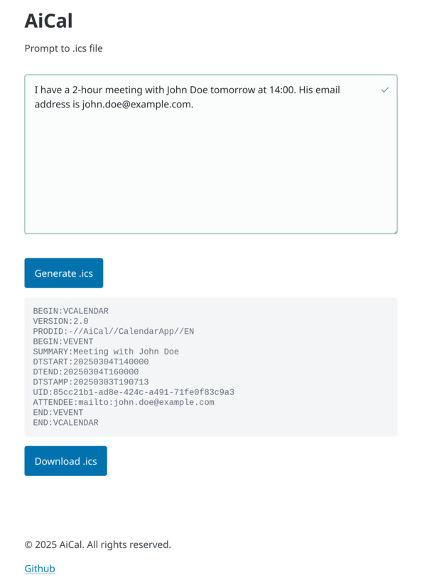
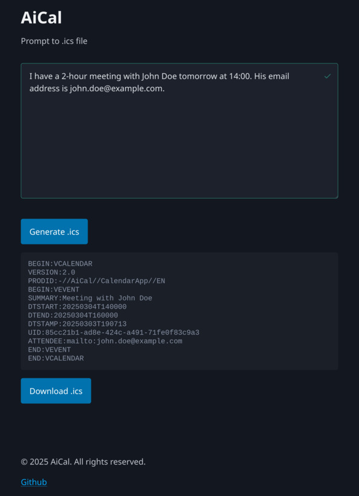

# AiCal

AiCal is an application that converts user prompts into `.ics` calendar files using AI.

## Clients

Below you can find two options to access AiCal.

### Web page

A web page can be found in `clients/index.html`.
The web page is deploy at [www.ai-cal.xyz](https://www.ai-cal.xyz).

| Light                                           | Dark                                           |
|-------------------------------------------------|------------------------------------------------|
|  |  |

### Shell script

A shell script can be found in `clients/ai-cal.sh`.

```bash
# Usage: ai-cal.sh [options] [prompt]
# Options:
#   -h  Display this help message
#   -o FILE  Save the 'ics' content to the specified FILE
```
Example of usage:
```
ai-cal.sh                        # input prompt interactively
ai-cal.sh "event prompt"         # prompt as an argument
cat event_prompt | ai-cal.sh     # prompt from standard input
```

## Setup

1. Create virtual environment and install dependencies:
   ```bash
   python -m venv venv
   source venv/bin/activate
   pip install -r requirements.txt
   ```
2. Set up the environment variables by creating a `.env` file from `.env.example`:
   ```bash
   cp .env.example .env
   ```

3. Update the `.env` file with your OpenAI credentials:
   ```
   OPENAI_API_KEY=your_api_key
   OPENAI_BASE_URL=your_base_url
   MODEL=gpt-4o-mini or a different model
   ```

4. Run the application
   ```bash
   venv/bin/python -m uvicorn app.main:app --host 0.0.0.0 --port 8080 --reload
    ```